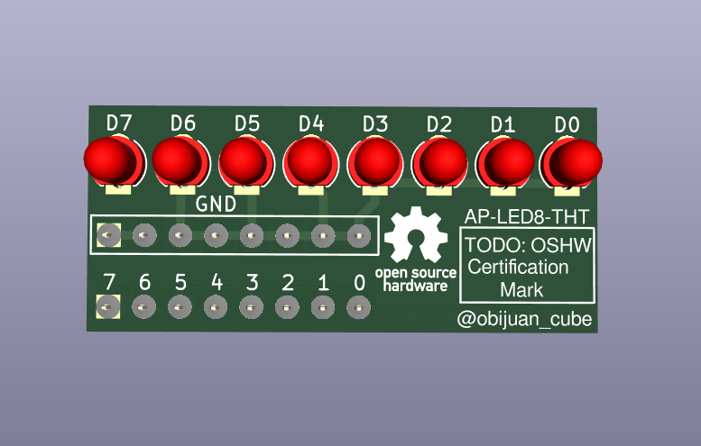
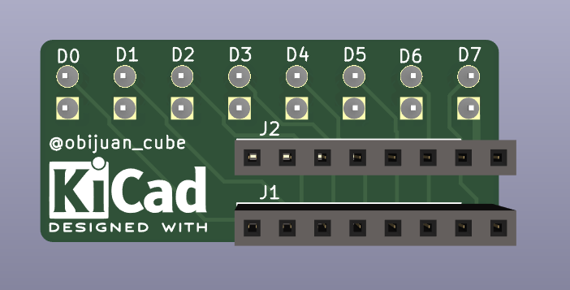
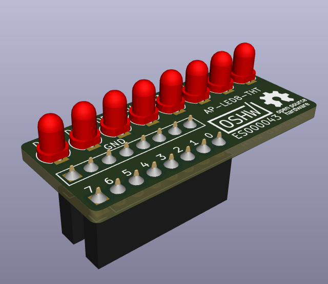
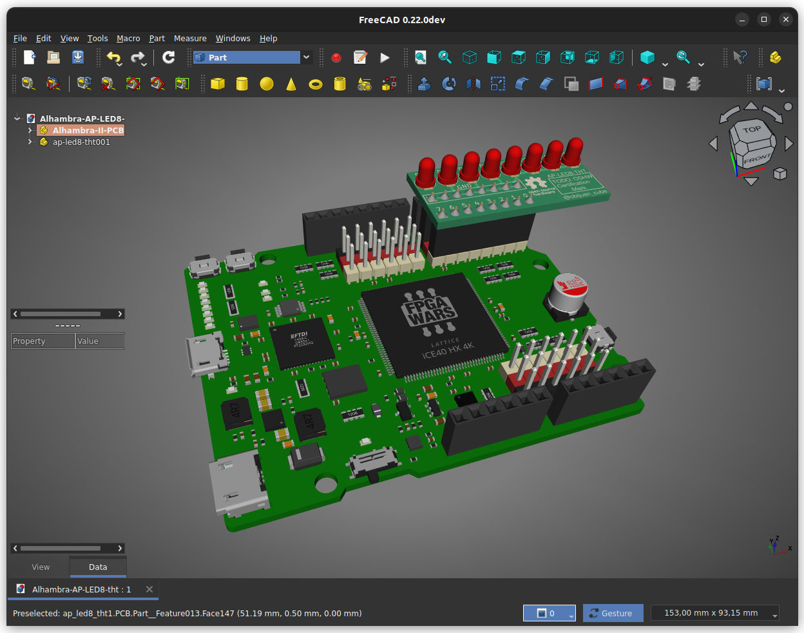
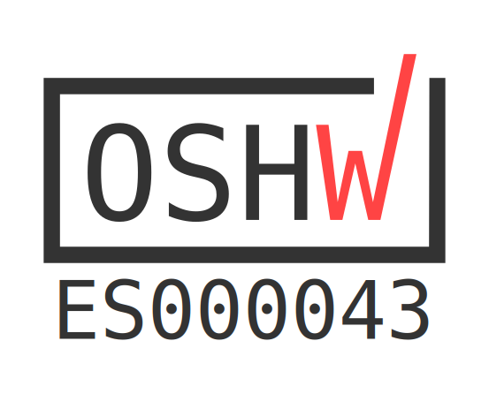

# AP-LED8-THT
Alhambra Peripheral board with 8 through-hole LEDs

It is a tiny board with eight 3mm though-hole LEDs for connecting to the Alhambra-II FPGA board.  
This board is also used as a reference for teaching students how to design their first PCB (so, it is a kind of "hello world" hardware)

  
  
  

## Connection to Alhambra II Board

## Certification mark

This board is Opensource hardware, certified by the [OSHWA](https://www.oshwa.org/)

* Certification ID: [ES000043](https://certification.oshwa.org/es000043.html)  

* Certification mark:

## License

Documentation licensed under the [Creative Commons Attribution Share Alike 4.0 International License](https://creativecommons.org/licenses/by-sa/4.0/)  

