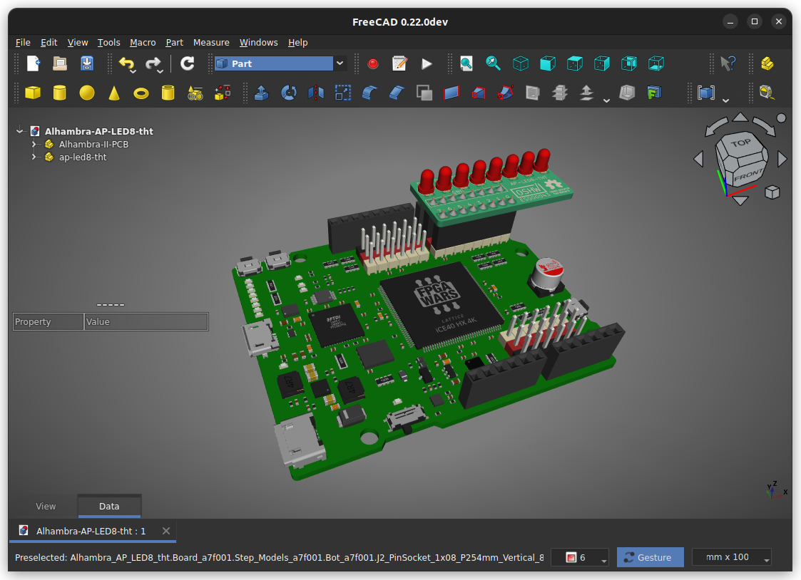

# AP-LED8-THT
Alhambra Peripheral board with 8 through-hole LEDs

It is a tiny board with eight 3mm though-hole LEDs for connecting to the Alhambra-II FPGA board.  
This board is also used as a reference for teaching students how to design their first PCB (so, it is a kind of "hello world" hardware)

  
  
  

## Conection to Alhambra II Board

## License

Documentation licensed under the [Creative Commons Attribution Share Alike 4.0 International License](https://creativecommons.org/licenses/by-sa/4.0/)  

